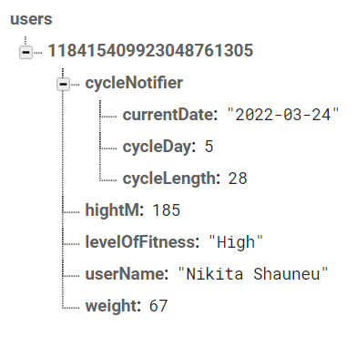

# User module for "The Welln" application.

Module provides a tool for working with user information and creating 
Database of workouts.  

## General description:

For all manipulations with data there was provided class **AppUser**. 
It personalizes all methods' results based on the current user's characteristics.
It stores field of type **UserInformation** that contains all personalized parameters
as a map of named variables and a String **userID** with unique ID after signing 
in with Google account.

The structure of information storage:
```
AppUser:
    - String userID;
    - UserInformation userInformation:
        - String userName;
        - int weight;
        - int heightM;
        - CycleNotifier cycleNotifier:
            - int cycleLength;
            - int cycleDay;
```

In the DB all info about current user is contained in directory ./users/usersID. According to 
security rules, only user with appropriate ID can read and write to this directory. User's 
profile stores in the DB in the following way:



### Constructors and filling information for **AppUser**:

There is only one public constructor that initializes the field *userID*:
``` AppUser(String? currentID).``` It creates at the start of the application an object ```appUser``` 
with ```appUser.userID == null```. All interaction between the user and the application is done 
through this instance.

After that it is necessary to call ```Future appUser.singInWithGoogle()``` method, that will fill
the field ```appUser.userID``` with unique ID. Furthermore, it requests userInformation from DB and 
if the application was previously used with authorization through this Google 
account (i.e. there exists directory ./users/userID), ```appUser.userInformation``` with 
appropriate information from DB. Otherwise (after signing in ```appUser.userInformation == null```), 
it is necessary to view InfoFillWidget, in which new user can add his params. 

### Updating information for AppUser:
On the InfoFillWidget params of the ```appUser.userInformation``` and in the directory 
./users/appUser.userID  update separately with```Future appUser.updateInfo(Map<String, dynamic> infoLine)```. 
Correct ```infoLine``` must have one of following forms:
- ```{"userName" : String}```;
- ```{"weight" : int}```;
- ```{"heightM" : int}```;
- ```{"cycleNotifier" : {"cycleDay" : int}}```;
- ```{"cycleNotifier" : {"cycleLength" : int}}```.
Other forms or unrealistic params result in a CustomErrorMessage (will be beautiful, but not now).
```appUser.updateInfo``` also can be used during session to change existing params if it is necessary.

### Appropriate workouts' provider:

Method ```List<WorkoutTheme> returnAppropriateThemes()``` returns recommended workout themes 
for current cycle phase. 

For each theme there exists method ```Future<List<SingleWorkout>> returnListOfWorkouts``` 
to access DB and get appropriate exercises.

### SingleWorkout class:
SingleWorkout contains fields ```String nameOfWorkout``` and ```String pictureUrl```.
Maybe later we add more params, so there exists factory method ```SimpleWorkout.fromMap
(Map<String, dynamic> info)```, where info has the following form:
- ```{"name_of_workout" : { /* named params such as pictureUrl */}}```.


